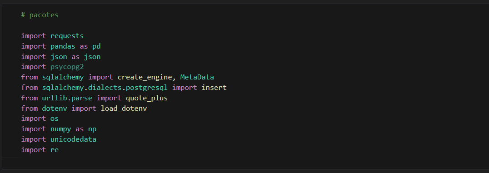
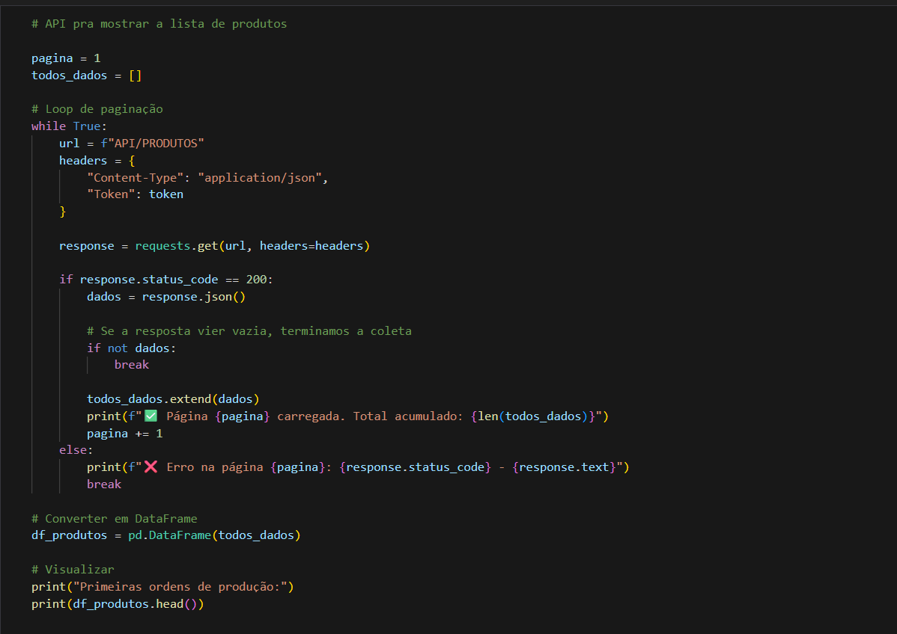
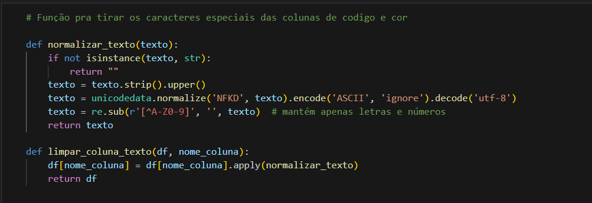
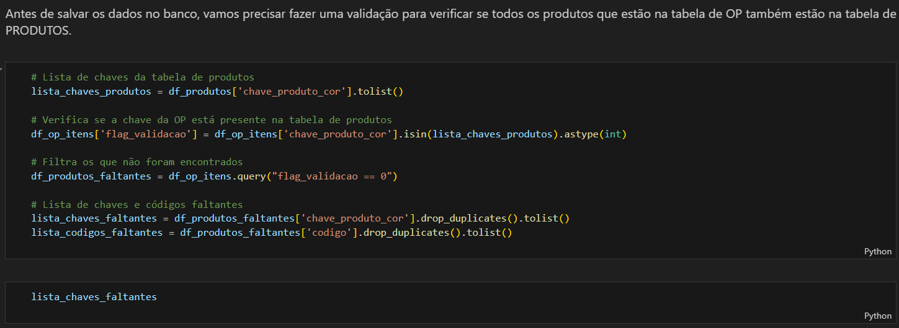
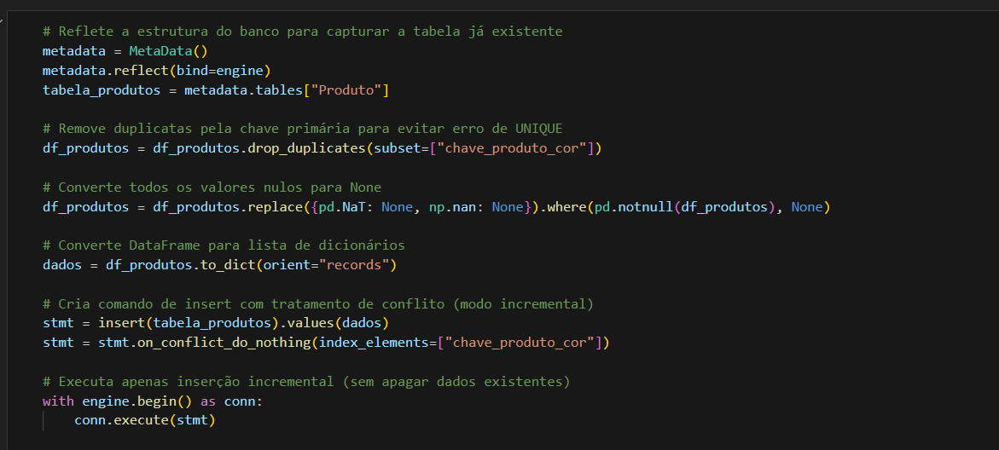

# ETL - Extract | Transform | Load

Para o projeto realizamos o consumo de 4 principais Apis (Produtos, Pedidos, Ordens de Produção e Clientes). Também criamos um processo para ETL dos dados de usuários, máquinas e marcas que não serão expostos neste repositório.

# ETL de Produtos

Nesse ETL fizemos o consumo de uma lista de produtos do cliente, aplicando algumas transformações e padronizações para salvar no novo datamart criado.

Obs: Os arquivos ipynb foram transformados em .py posteriormente.

## Bibliotecas

## Consumo da API

## Funções

## Validação

Foram encontrados alguns casos em que temos produtos em Ordens de Produção que não estão em "Produtos" para isso fizemos a validação abaixo e os que encontramos inserimos na tabela com as demais informações como "Não Identificado".

## Load

*Para mais detalhes, veja os arquivos completos em \etl\notebooks*

